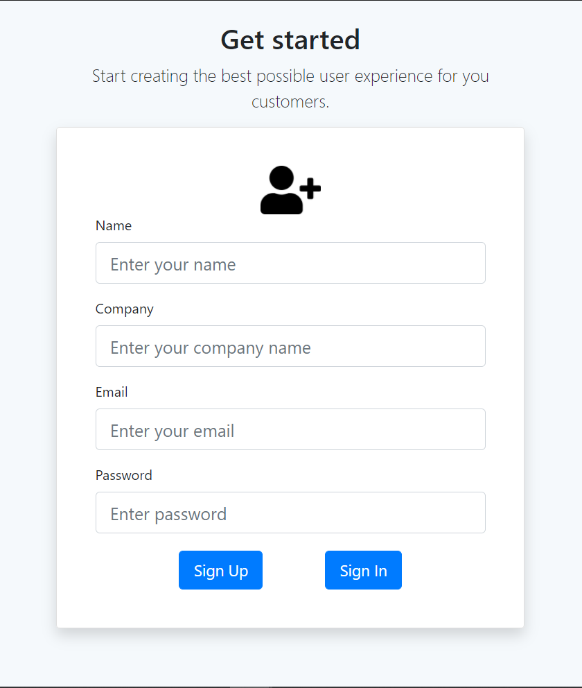
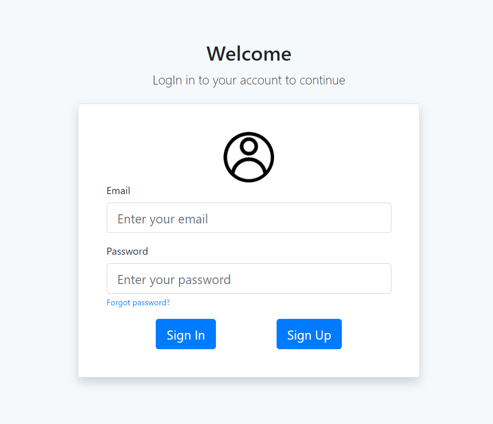
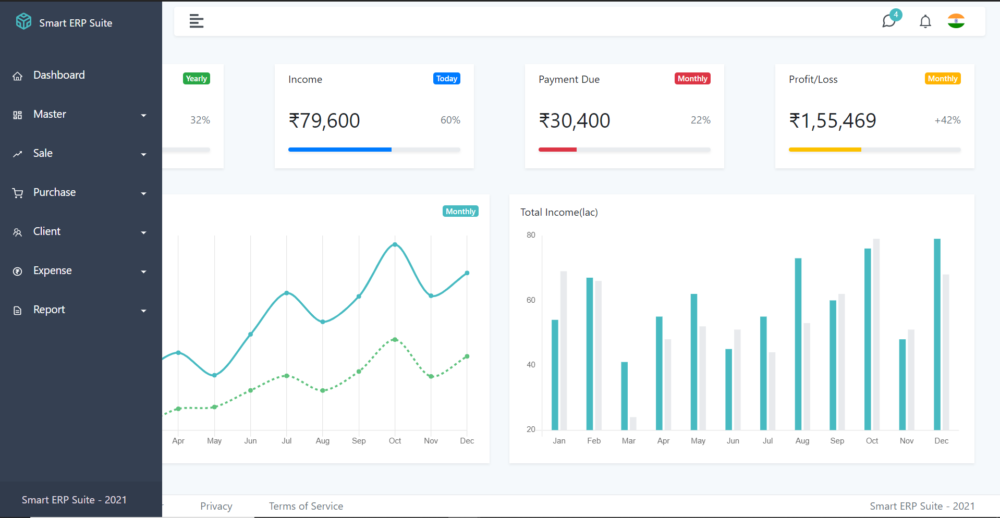
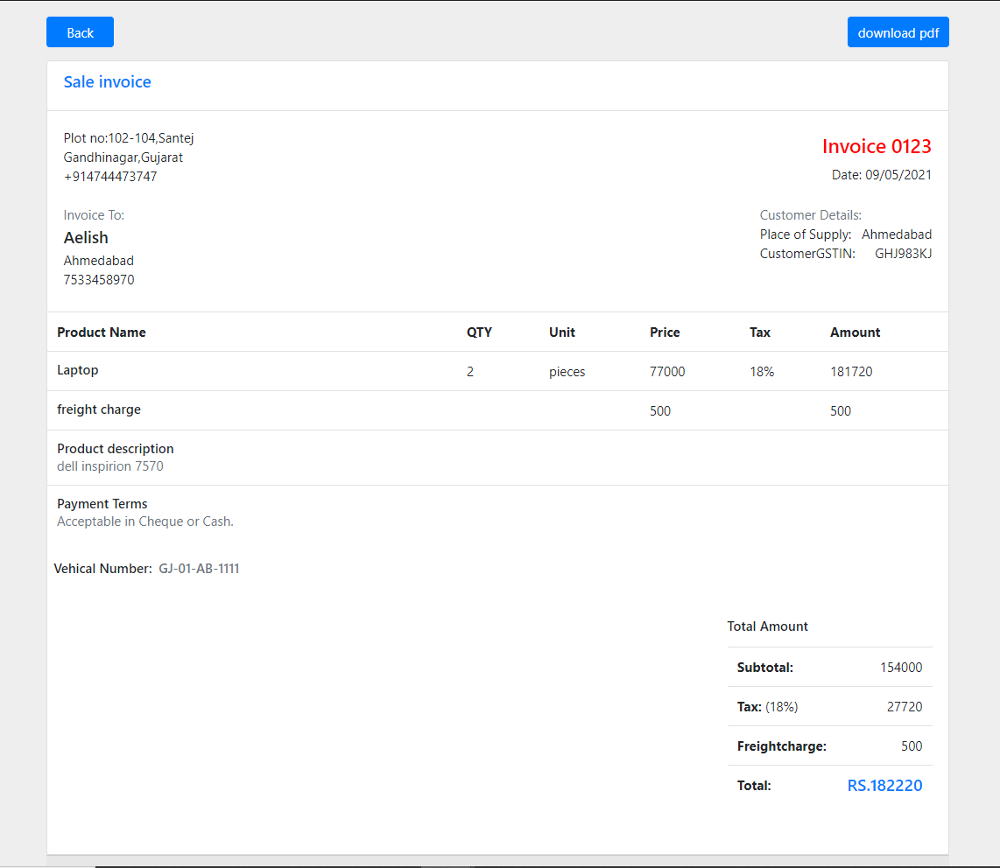
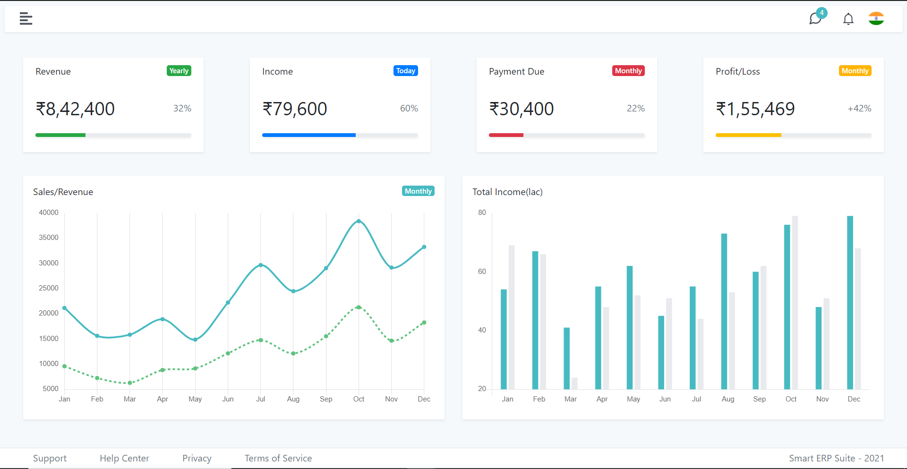

# Project: Smart ERP Suite

***Smart ERP Suite is a web based ERP software.***
 

* An ERP system provides a centralized database where all department's information is shared and accessed by authorized persons that can provide transparency in business and promote collaboration among departments.
* By ERP system, we can make fact-based fast decisions.

In our web-based solution, there exist various modules such as Master, Sale, Purchase, Client, Expense, Report.

## Tools/Technology used:
* MongoDB
* ExpressJS
* ReactJS
* NodeJS

## Screenshots of Modules:
* SignUp Page

* SignIn Page

* Sidebar Page

* Invoice Page

* Dashboard Page

